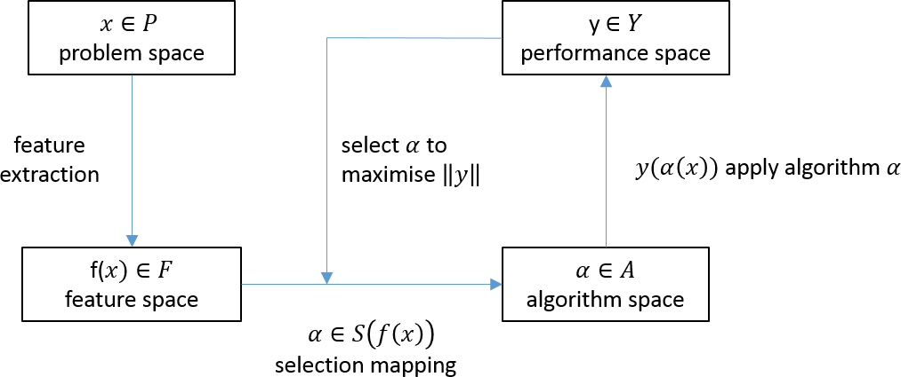

```{r setup, include=FALSE}
knitr::opts_chunk$set(echo = FALSE, cache=TRUE, messages=FALSE, warning=FALSE)
library(knitr)
opts_chunk$set(
  warning = FALSE,
  message = FALSE,
  echo = FALSE,
  fig.path = "figure/",
  cache.path = "cache/",
  fig.align = "center",
  fig.show = "hold",
  cache = TRUE,
  external = TRUE,
  dev = "pdf",
  fig.height = 5,
  fig.width = 8,
  out.width = "\\textwidth"
)
library(Mcomp)
library(ggplot2)
library(grid)
library(gridExtra)
library(ggrepel)
library(png)
library(tsfeatures)
library(tidyverse)
library(ggpubr)
```


# Introduction


# Literature review {#litreview}

## Time series features

Rather than work with the time series directly at the level of individual observations, we propose analysing time series via an associated "feature space". A time series feature is any measurable characteristic of a time series. For example, \autoref{fig:fig1} shows the time-domain representation of six time series taken from the M3 competition [@makridakis2000m3] while \autoref{fig:fig2} shows a feature-based representation of the same time series. Here only two features are considered: the strength of seasonality and the strength of trend, calculated based on the measures introduced by @wang2009rule. Time series in the lower right quadrant of \autoref{fig:fig2} are non-seasonal but trended, while there is only one series with both high trend and high seasonality. We also see how the degree of seasonality and trend varies between series. Other examples of time series features include autocorrelation, spectral entropy and measures of self-similarity and nonlinearity. @fulcher2014highly identified 9000 operations to extract features from time series.


```{r fig1, fig.cap="Time-domain representation of time series", fig.width=10, fig.height=6}
# Extract required series
series_id <- c("N0001", "N0633", "N0625", "N0645","N1912", "N2012")
six_series <- lapply(M3[series_id], function(u){u$x})
p <- lapply(six_series,
  function(u) {autoplot(u) + xlab("") + ylab("")}
)
for (i in seq_along(six_series))
  p[[i]] <- p[[i]] + ggtitle(series_id[i])
grid.arrange(grobs = p, ncol = 3, nrow = 2)
```

```{r fig2, fig.cap="Feature-based representation of time series", out.width="70%"}
df <- tsfeatures(six_series, c("stl_features")) %>%
  select(trend, seasonal_strength) %>%
  rename(seasonality = seasonal_strength) %>%
  replace_na(list(seasonality = 0))
df$id <- names(six_series)
ggplot(df, aes(x = trend, y = seasonality)) +
  geom_point() +
  xlim(0, 1) + ylim(0, 1) +
  coord_fixed() +
  geom_text_repel(
    aes(label = id),
    colour = "black",
    size = 3,
    box.padding = unit(0.5, "lines")
  ) +
  theme(legend.position = "none")
```


The choice of the most appropriate set of features depends on both the nature of the time series being analysed, and the purpose of the analysis. In \autoref{Mcomp}, we study the time series from the M1 and M3 competitions [@makridakis1982accuracy;@makridakis2000m3], and we select features for the purpose of forecast-model selection. The M1 and M3 competitions involve time series of differing length, scale and other properties. We include length as one of our features, but the remaining features are independent of scale and asymptotically independent of the length of the time series (i.e., they are ergodic). As our main focus is forecasting, we select features which have discriminatory power in selecting a good model for forecasting.

## What makes features useful for forecast-model selection?

@reid1972comparison points out that the performance of forecasting methods changes according to the nature of the data. Exploring the reasons for these variations may be useful in selecting the most appropriate model. In response to the results of the M3 competition [@makridakis2000m3], similar ideas have been put forward by others. @hyndman2001s, @lawrence2001s and @armstrong2001s argue that the characteristics of a time series may provide useful insights into which methods are most appropriate for forecasting.

Many time series forecasting techniques have been developed to capture specific characteristics of time series that are common in a particular discipline. For example, GARCH models were introduced to account for time-varying volatility in financial time series, and ETS models were introduced to handle the trend and seasonal patterns which are typical in quarterly and monthly sales data. An appropriate set of features should reveal the characteristics of the time series that are useful in determining the best forecasting method.

Several researchers have introduced rules for forecasting based on features [@collopy1992rule;@adya2001automatic;@wang2009rule]. Most recently @kang2017visualising applied principal component analysis to project a large collection of time series into a two dimensional feature space in order to visualize what makes a particular forecasting method perform well or not. The features they considered were spectral entropy, first-order auto-correlation coefficient, strength of trend, strength of seasonality, seasonal period and the optimal Box-Cox transformation parameter. They also proposed a method for generating new time series based on specified features.

## Meta-learning for algorithm selection

John Rice was an early and strong proponent of the idea of meta-learning, which he called the algorithm selection problem (ASP) [@rice1976]. The term *meta-learning* started to appear with the emergence of the machine-learning literature. Rice's framework for algorithm selection is shown in \autoref{fig:rice} and comprises four main components. The problem space, $P$, represents the data sets used in the study. The feature space, $F$, is the range of measures that characterize the problem space $P$. The algorithm space, $A$, is a list of suitable candidate algorithms which can be used to find solutions to the problems in $P$. The performance metric, $Y$, is a measure of algorithm performance such as accuracy, speed, etc. A formal definition of the algorithm selection problem is given by @smith2009cross, and repeated below.

>**Algorithm selection problem**. For a given problem instance $x \in P$, with features $f(x) \in F$, find the selection mapping $S(f(x))$ into algorithm space $A$, such that the selected algorithm $\alpha \in A$ maximizes the performance mapping $y(\alpha(x)) \in Y$.

```{r rice, fig.cap="Rice's framework for the Algorithm Selection Problem.", out.width="80%"}

```

The main challenge in ASP is to identify the selection mapping $S$ from the feature space to the algorithm space. Even though Rice's framework articulates a conceptually rich framework, it does not specify how to obtain $S$. This gives rise to the meta-learning approach.


## Forecast-model selection using meta-learning

Selecting models for forecasting can be framed according to Rice's ASP framework.

>**Forecast-model selection problem**. For a given time series $x \in P$, with features $f(x) \in F$, find the selection mapping $S(f(x))$ into the algorithm space $A$, such that the selected algorithm $\alpha \in A$ minimizes forecast accuracy error metric $y(\alpha(x)) \in Y$ on the test set of the time series.

Existing methods differ with respect to the way they define the problem space ($A$), the features ($F$), the forecasting accuracy measure ($Y$) and the selection mapping ($S$).

@collopy1992rule introduced 99 rules based on 18 features of time series, in order to make forecasts for economic and demographic time series. This work was extended by @armstrong2001s to reduce human intervention.

@shah1997model used the following features to classify time series: the number of observations, the ratio of the number of turning points to the length of the series, the ratio of number of step changes, skewness, kurtosis, the coefficient of variation, autocorrelations at lags 1--4, and partial autocorrelations at lag 2--4. Casting Shah's work in Rice's framework, we can specify: $P=203$ quarterly series from the M1 competition [@makridakis1982accuracy]; $A=3$ forecasting methods, namely simple exponential smoothing, Holt-Winters exponential smoothing with multiplicative seasonality, and a basic structural time series model; $Y=$ mean squared error for a hold-out sample. @shah1997model learned the mapping $S$ using discriminant analysis.

@prudencio2004meta was the first paper to use the term "meta-learning" in the context of time series model selection. They studied the applicability of meta-learning approaches for forecast-model selection based on two case studies. Again using the notation above, we can describe their first case study with: $A$ contained only two forecasting methods, simple exponential smoothing and a time-delay neural network; $Y=$ mean absolute error; $F$ consisted of 14 features, namely length, autocorrelation coefficients, coefficient of variation, skewness, kurtosis, and a test of turning points to measure the randomness of the time series;  $S$ was learned using the C4.5 decision tree algorithm. For their second study, the algorithm space included a random walk, Holt's linear exponential smoothing and AR models; the problem space $P$ contained the yearly series from the M3 competition [@makridakis2000m3]; $F$ included a subset of features from the first study; and $Y$ was a ranking based on error. Beyond the task of forecast-model selection, they used the NOEMON approach to rank the algorithms [@kalousis1999noemon].

@lemke2010meta studied the applicability of different meta-learning approaches for time series forecasting. Their algorithm space $A$ contained ARIMA models, exponential smoothing models and a neural network model. In addition to statistical measures such as the standard deviation of the de-trended series, skewness, kurtosis, length, strength of trend, Durbin-Watson statistics of regression residuals, the number of turning points, step changes, a predictability measure, nonlinearity, the largest Lyapunov exponent, and auto-correlation and partial-autocorrelation coefficients, they also used frequency domain based features. The feed forward neural network, decision tree and support vector machine approaches were considered to learn the mapping $S$.

@wang2009rule used a meta-learning framework to provide recommendations as to which forecast method to use to generate forecasts. In order to evaluate forecast accuracy, they introduced a new measure $Y =$ *simple percentage better (SPB)*, which calculates the forecasting accuracy of a method against the forecasting accuracy error of random walk model. They used a feature set $F$ comprising nine features: strength of trend, strength of seasonality, serial correlation, nonlinearity, skewness, kurtosis, self-similarity, chaos and periodicity. The algorithm space $A$ included eight forecast-models, namely, exponential smoothing, ARIMA, neural networks and random walk model; while the mapping $S$ was learned using the C4.5 algorithm for building decision trees. In addition, they used SOM clustering on the features of the time series in order to understand the nature of time series in a two-dimensional setting.

The set of features introduced by @wang2009rule was later used by @widodomodel to develop a meta-learning framework for forecast-model selection. The authors further reduced the dimensionality of time series by performing principal component analysis on the features.

More recently, @kuck2016meta proposed a meta-learning framework based on neural networks for forecast-model selection. Here, $P = 78$ time series from the NN3 competition were used to build the meta-learner. They introduced a new set of features based on forecasting errors. The average symmetric mean absolute percentage error was used to identify the best forecast-models for each series. They classify their forecast-models in the algorithm space $A$, comprising single, seasonal, seasonal-trend and trend exponential smoothing. The mapping $S$ was learned  using a feed-forward neural network. Further, they evaluated the performance of different sets of features for forecast-model selection.

# Appendix A: Definition of features {-}

### Length of time series {-}

The appropriate forecast method for a time series depends on how many observations are available. For example, shorter series tend to need simple models such as a random walk. On the other hand, for longer time series, we have enough information to be able to estimate a number of parameters. For even longer series (over 200 observations), models with time-varying parameters give good forecasts as they help to capture the changes of the model over time.

### Features based on an STL-decomposition {-}

The strength of trend, strength of seasonality, linearity, curvature, spikiness and first autocorrelation coefficient of the remainder series, are calculated based on a decomposition of the time series. Suppose we denote our time series as $y_1, y_2, \dots,y_T$. First, an automated Box-Cox transformation [@Guerrero1993] is applied to the time series in order to stabilize the variance and to make the seasonal effect additive. The transformed series is denoted by $y_{t}^*$. For quarterly and monthly data, this is decomposed using STL [@cleveland1990stl] to give $y_t^*=T_t+S_t+R_t$, where $T_t$ denotes the trend, $S_t$ denotes the seasonal component, and $R_t$ is the remainder component. For non-seasonal data, Friedman's super smoother [@supsmu] is used to decompose $y_t^*=T_t+R_t$, and $S_t=0$ for all $t$. The de-trended series is $y_t^*-T_t=S_t+R_t$, the deseasonalized series is $y_t^*-S_t = T_t+R_t$..

The strength of trend is measured by comparing the variance of the deseasonalized series and the remainder series [@wang2009rule]:
$$
	\text{Trend} = \text{max}\left[0, 1 - \var(R_{t})/\var(T_t+R_t)\right].
$$
Similarly, the strength of seasonality is computed as
\[
	\text{Seasonality} = \text{max}\left[0, 1- \var(R_{t})/ \var(S_t+R_t)\right].
\]


The linearity and curvature features are based on the coefficients of an orthogonal quadratic regression
\[
  T_t=\beta_0+\beta_1 \phi_1(t) + \beta_2\phi_2(t) + \varepsilon_t,
\]
where $t=1, 2, \dots,T$, and $\phi_1$ and $\phi_2$ are orthogonal polynomials of orders 1 and 2. The estimated value of $\beta_1$ is used as a measure of linearity while the estimated value of $\beta_2$ is considered as a measure of curvature. These features were used by @hyndman2015large. The linearity and curvature depend on the the scale of the time series. Therefore, the time series are scaled to mean zero and variance one before these two features are computed.

The spikiness feature is useful when a time series is affected by occasional outliers. @hyndman2015large introduced an index to measure spikiness, computed as the variance of the leave-one-out variances of $r_t$.

We compute the first autocorrelation coefficient of the remainder series, $r_t$.

### Stability and lumpiness {-}

The features "stability" and "lumpiness" are calculated based on tiled windows (i.e., they do not overlap). For each window, the sample mean and variance are calculated.  The stability feature is calculated as the variance of the means, while lumpiness is the variance of the variances. These were first used by @hyndman2015large.

### Spectral entropy of a time series {-}

Spectral entropy is based on information theory, and can be used as a measure of the forecastability of a time series. Series that are easy to forecast should have a small spectral entropy value, while very noisy series will have a large spectral entropy. We use the measure introduced by @goerg2013forecastable to estimate the spectral entropy. It estimates the Shannon entropy of the spectral density of the  normalized spectral density, given by
\[
  H_{s}(y_t):=-\int_{-\pi}^{\pi}\hat f_y(\lambda)\log \hat f_y({\lambda})d\lambda,
\]
where $\hat{f}_y$ denotes the estimate of the spectral density introduced by @nuttall1982spectral. The R package ForeCA [@Foreca] was used to compute this measure.

### Hurst exponent {-}

The Hurst exponent measures the long-term memory of a time series. The Hurst exponent is given by $H=d+0.5$, where $d$ is the fractal dimension obtained by estimating a ARFIMA($0, d, 0$) model. We compute this using the maximum likelihood method [@haslett1989space] as implemented in the fracdiff package [@fracdiff]. This measure was also used in @wang2009rule.

### Nonlinearity {-}

To measure the degree of nonlinearity of the time series, we use statistic computed in Terasvirta's neural network test for nonlinearity [@nonlintest], also used in @wang2009rule. This takes large values when the series is nonlinear, and values around 0 when the series is linear.

### Parameter estimates of an ETS model {-}

The ETS(A,A,N) model [@expsmooth08] produces equivalent forecasts to Holt's linear trend method, and can be expressed as follows:
\begin{align*}
  y_t    & = \ell_{t-1}+b_{t-1}+\varepsilon_t\\
  \ell_t & = \ell_{t-1}+b_{t-1}+\alpha \varepsilon_t\\
  b_t    & = b_{t-1}+\beta \varepsilon_t,
\end{align*}
where $\alpha$ is the smoothing parameter for the level, and $\beta$ is the smoothing parameter for the trend. We include the parameter estimates of both $\alpha$ and $\beta$ in our feature set for yearly time series. These indicate the variability in the level and slope of the time series.

The ETS(A,A,A) model [@expsmooth08] produces equivalent forecasts to Holt-Winters' additive method, and can be expressed as follows:
\begin{align*}
  y_t    & = \ell_{t-1}+b_{t-1}+s_{t-m}+\varepsilon_t\\
  \ell_t & = \ell_{t-1}+b_{t-1}+s_{t-m}+\alpha \varepsilon_t\\
  b_t    & = b_{t-1}+\beta \varepsilon_t,\\
  s_t &= s_{t-m} + \gamma\varepsilon_t,
\end{align*}
where $\gamma$ is the smoothing parameter for the seasonal component, and the other parameters are as above.  We include the parameter estimates of $\alpha$,  $\beta$ and $\gamma$ in our feature set for monthly and quarterly time series. The value of $\gamma$ provides a measure for the variability of the seasonality of a time series.

### Unit root test statistics {-}

The Phillips-Perron test is based on the regression $y_t= c + \alpha y_{t-1}+ \varepsilon_t$. The test statistic we use as a feature is the usual "Z-alpha" statistic with the Bartlett window parameter set to the integer value of $4(T/100)^{0.25}$ [@Pfaff2008]. This is the default value returned from the `ur.pp()` function in the `urca` package [@pfaff2016package].

The KPSS test is based on the regression $y_t=c+\delta t+\alpha y_{t-1}+\varepsilon_t$. The test statistic we use as a feature is the usual KPSS statistic with the Bartlett window parameter set to the integer value of $4(T/100)^{0.25}$ [@Pfaff2008]. This is the default value returned from the `ur.kpss()` function in the `urca` package [@pfaff2016package].


### Autocorrelation coefficient based features {-}

We calculate the first-order autocorrelation coefficient and the sum of squares of the first five autocorrelation coefficients of the original series, the first-differenced series, the second-differenced series, and the seasonally differenced series (for seasonal data).

A linear trend model is fitted to the time series, and the first-order autocorrelation coefficient of the residual series is calculated.

We calculate the sum of squares of the first five partial autocorrelation coefficients of the original series, the first-differenced series and the second-differenced series.

