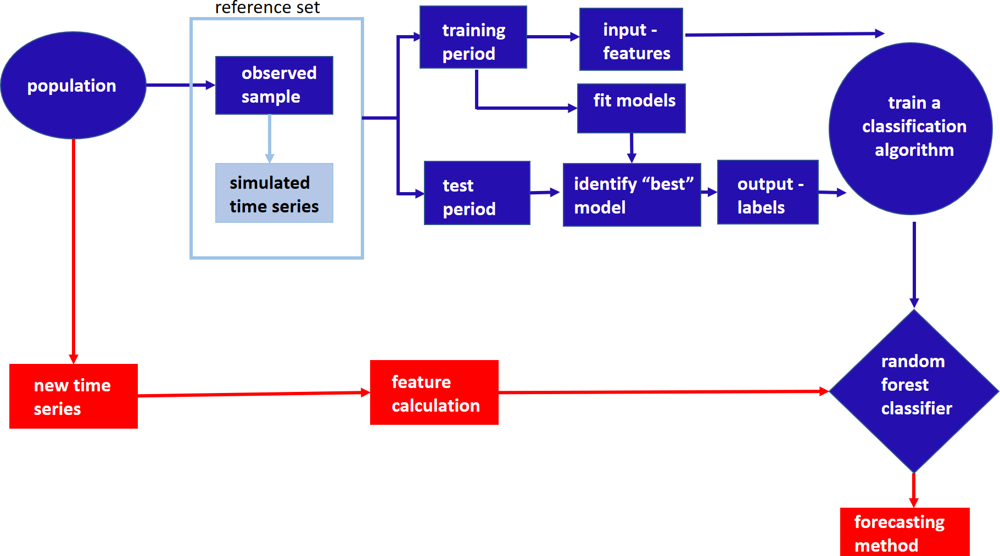

```{r setup, include=FALSE}
knitr::opts_chunk$set(echo = FALSE, cache = TRUE, messages = FALSE, warning = FALSE)
library(knitr)
opts_chunk$set(
  warning = FALSE,
  message = FALSE,
  echo = FALSE,
  fig.path = "figure/",
  cache.path = "cache/",
  fig.align = "center",
  fig.show = "hold",
  cache = TRUE,
  external = TRUE,
  dev = "pdf",
  fig.height = 5,
  fig.width = 8,
  out.width = "\\textwidth"
)
read_chunk("src/main.R")
read_chunk("src/flexdashboardviz.R")
library(Mcomp)
library(ggplot2)
library(grid)
library(gridExtra)
library(ggrepel)
library(png)
library(tsfeatures)
library(tidyverse)
library(ggpubr)
library(reshape2)
library(patchwork)
library(Hmisc)
library(seer)
library(iheatmapr)
library(webshot)
```

# Introduction

Forecasting is a key activity for any business to operate efficiently. The rapid advances in computing technologies have enabled businesses to keep track of large numbers of time series. Hence, it is becoming increasingly common to have to regularly forecast many millions of time series. For example, large scale businesses may be interested in forecasting sales, cost, and demand for their thousands of products across various locations, warehouses, etc. Technology companies such as Google collect many millions of daily time series such as web-click logs, web search counts, queries, revenues, number of users for different services, etc. Such large collections of time series require fast automated procedures generating accurate forecasts. The scale of these tasks has raised some computational challenges we seek to address by proposing a new fast algorithm for model selection and time series forecasting.

Two alternative strategies for generating such a large number of forecasts are: (1) to either use a single forecasting method across all the time series; or (2) to select an appropriate forecasting method for each time series individually. It is highly unlikely that a single method will consistently outperform judiciously chosen competitor methods across all time series. We therefore reject the former strategy and focus on an approach for selecting an individual forecasting method for each time series.

Selecting the most appropriate model for forecasting a given time series can be challenging. Two of the most commonly used automated algorithms are the exponential smoothing (`ets`) algorithm of @Hyndman2002 and the ARIMA (`auto.arima`) algorithm of @Hyndman2008. Both algorithms are implemented in the forecast package in R [@Rcore;@forecast]. In this paradigm, a class of models is selected in advance, and many models within that class are estimated for each time series. The model with the smallest AICc value is chosen and used for forecasting. This approach relies on the expert judgement of the forecaster in first selecting the most appropriate class of models to use, as it is not usually possible to compare AICc values between model classes due to differences in the way the likelihood is computed, and the way initial conditions are handled.

An alternative approach, which avoids selecting a class of models *a priori*, is to use a simple "hold-out" test set; but then there is often insufficient data to draw a reliable conclusion. To overcome this drawback, time series cross-validation can be used [@racine2000consistent; @hyndman2014forecasting]; then models from many different classes may be applied, and the model with the lowest cross-validated MSE selected. However, this increases the computation time involved considerably (at least to order $n^2$ where $n$ is the number of series to be forecast).

Clearly, there is a need for a fast and scalable algorithm to automate the process of selecting models with the aim of forecasting. We refer to this process as forecast-model selection. We propose a general meta-learning framework using features of the time series to select the class of models, or even the specific model, to be used for forecasting. The forecast-model selection process is carried out using a classification algorithm --- we use the time series features as inputs, and the "best" forecasting model as the output. The classifier is built using a large historical collection of time series, in advance of the forecasting task at hand. Hence, this is an "offline" procedure.

The "online" process of generating forecasts only involves calculating the features of a time series and using the pre-trained classifier to identify the best forecasting model. Hence, generating forecasts only involves the estimation of a single forecasting model, with no need to estimate large numbers of models within a class, or to carry out a computationally-intensive cross-validation procedure. We refer to this general framework as FFORMS (**F**eature-based **FOR**ecast-**M**odel **S**election).

There have been several recent studies on the use of meta-learning approaches to automate forecast model selection based on features computed from the time series [@shah1997model; @prudencio2004meta; @lemke2010meta; @kuck2016meta]. However, to the best of our knowledge, a very limited effort has been made to understand how the meta-learners are making their decisions and what is really happening inside these complex model structures.  To fill these gaps, this paper makes a first step towards providing a comprehensive analysis of the relationship between time series features and forecast model selection using machine learning interpretability techniques. We try to answer the following questions:
  i) **What** are the similarities and dissimilarities identified by the meta-learner between class-labels?
  ii) **Which** features contribute most to the classification process?   
  iii) **How** are features related to the property being modelled? 
  iv) **How** do features interact with each other to identify a suitable forecasting model? We believe addressing these questions can enhance the transparency of the model predictions and build trust trust in model's predictions.

The remainder of the paper is structured as follows. We review the related work in \autoref{litreview}. In  \autoref{fforms} we explain the detailed components and procedures of our proposed framework for forecast model selection. \autoref{results} presents the forecasting results in application to the M4-competition data. \autoref{peeking} presents the results of what is happening under the hood of FFORMS? followed by the conclusions and future work in \autoref{discussion}.

# Related work {#litreview}

## Time series features

@reid1972comparison points out that the performance of forecasting methods changes according to the nature of the data. Exploring the reasons for these variations may be useful in selecting the most appropriate model. In response to the results of the M3 competition [@makridakis2000m3], similar ideas have been put forward by others. @hyndman2001s, @lawrence2001s and @armstrong2001s argue that the characteristics of a time series may provide useful insights into which methods are most appropriate for forecasting.

Rather than work with the time series directly at the level of individual observations, we propose analysing time series via an associated "instance space given by the features". A time series feature is any measurable characteristic of a time series. For example, \autoref{fig:fig1} (left panel) shows the time-domain representation of six time series taken from the M3 competition [@makridakis2000m3] while \autoref{fig:fig1} (right panel) shows a feature-based representation of the same time series. Here only two features are considered: the strength of seasonality and the strength of trend, calculated based on the measures introduced by @wang2009rule. Time series in the lower right quadrant of the scatter plot are non-seasonal but trended, while there is only one series with both high trend and high seasonality. We also see how the degree of seasonality and trend varies between series. Other examples of time series features include autocorrelation, spectral entropy and measures of self-similarity and nonlinearity. @fulcher2014highly identified 9000 operations to extract features from time series.

The choice of the most appropriate set of features depends on both the nature of the time series being analysed, and the purpose of the analysis. In \autoref{results}, we study the time series from the M1, M3 and M4 competitions [@makridakis1982accuracy; @makridakis2000m3; @makridakis2019m4], and we select features for the purpose of forecast model selection. The M1, M3 and M4 competitions involve time series of differing length, scale and other properties. We include length as one of our features, but the remaining features are independent of scale and asymptotically independent of the length of the time series (i.e., they are ergodic). As our main focus is forecasting, we select features which have discriminatory power in selecting a good model for forecasting.

```{r fig1, fig.cap="Time-domain representation of time series (left) and feature-based representation of time series (right).", fig.width=10, fig.height=5}
# Extract required series
library(patchwork)
series_id <- c("N0001", "N0633", "N0625", "N0645", "N1912", "N2012")
six_series <- lapply(
  M3[series_id], 
  function(u) {u$x}
)
p <- lapply(
  six_series,
  function(u) {autoplot(u) + xlab("") + ylab("")}
)
for (i in seq_along(six_series)) {
  p[[i]] <- p[[i]] + ggtitle(series_id[i])
}
# p1 <- grid.arrange(grobs = p, ncol = 2, nrow = 3)
p1 <- (p[[1]] | p[[2]]) / ((p[[3]] | p[[4]])) / (p[[5]] | p[[6]])
df <- tsfeatures(six_series, c("stl_features")) %>%
  select(trend, seasonal_strength) %>%
  rename(seasonality = seasonal_strength) %>%
  replace_na(list(seasonality = 0))
df$id <- names(six_series)
p2 <- ggplot(df, aes(x = trend, y = seasonality)) +
  geom_point() +
  xlim(0, 1) +
  ylim(0, 1) +
  coord_fixed() +
  geom_text_repel(
    aes(label = id),
    colour = "black",
    size = 3,
    box.padding = unit(0.5, "lines")
  ) +
  theme(legend.position = "none")
p1 | p2
```

## Meta-learning for algorithm selection

John Rice was an early and strong proponent of the idea of meta-learning, which he called the algorithm selection problem (ASP) [@rice1976]. The term *meta-learning* started to appear with the emergence of the machine-learning literature.

```{r rice, fig.cap="Rice's framework for the Algorithm Selection Problem.", out.width="60%"}
knitr::include_graphics("images/RiceFramework.png")
```

Rice's framework for algorithm selection is shown in \autoref{fig:rice} and comprises four main components. The problem space, $P$, represents the data sets used in the study. The feature space, $F$, is the range of measures that characterize the problem space $P$. The algorithm space, $A$, is a list of suitable candidate algorithms which can be used to find solutions to the problems in $P$. The performance metric, $Y$, is a measure of algorithm performance such as accuracy, speed, etc. The main challenge in ASP to identify the selection mapping $S$ from the feature space to the algorithm space $A$. A formal definition of the algorithm selection problem is given by @smith2009cross, and repeated below.

>**Algorithm selection problem**. For a given problem instance $x \in P$, with features $f(x) \in F$, find the selection mapping $S(f(x))$ into algorithm space $A$, such that the selected algorithm $\alpha \in A$ maximizes the performance mapping $y(\alpha(x)) \in Y$.

## Forecast-model selection using meta-learning

Selecting models for forecasting can be framed according to Rice's ASP framework.

>**Forecast-model selection problem**. For a given time series $x \in P$, with features $f(x) \in F$, find the selection mapping $S(f(x))$ into the algorithm space $A$, such that the selected algorithm $\alpha \in A$ minimizes forecast accuracy error metric $y(\alpha(x)) \in Y$ on the test set of the time series.

Existing methods differ with respect to the way they define the problem space ($A$), the features ($F$), the forecasting accuracy measure ($Y$) and the selection mapping ($S$).

@collopy1992rule introduced 99 rules based on 18 features of time series, in order to make forecasts for economic and demographic time series. This work was extended by @armstrong2001s to reduce human intervention.

@shah1997model used the following features to classify time series: the number of observations, the ratio of the number of turning points to the length of the series, the ratio of number of step changes, skewness, kurtosis, the coefficient of variation, autocorrelations at lags 1--4, and partial autocorrelations at lag 2--4. Casting Shah's work in Rice's framework, we can specify: $P=203$ quarterly series from the M1 competition [@makridakis1982accuracy]; $A=3$ forecasting methods, namely simple exponential smoothing, Holt-Winters exponential smoothing with multiplicative seasonality, and a basic structural time series model; $Y=$ mean squared error for a hold-out sample. @shah1997model learned the mapping $S$ using discriminant analysis.

@prudencio2004meta was the first paper to use the term "meta-learning" in the context of time series model selection. They studied the applicability of meta-learning approaches for forecast model selection based on two case studies. Again using the notation above, we can describe their first case study with: $A$ contained only two forecasting methods, simple exponential smoothing and a time-delay neural network; $Y=$ mean absolute error; $F$ consisted of 14 features, namely length, autocorrelation coefficients, coefficient of variation, skewness, kurtosis, and a test of turning points to measure the randomness of the time series;  $S$ was learned using the C4.5 decision tree algorithm. For their second study, the algorithm space included a random walk, Holt's linear exponential smoothing and AR models; the problem space $P$ contained the yearly series from the M3 competition [@makridakis2000m3]; $F$ included a subset of features from the first study; and $Y$ was a ranking based on error. Beyond the task of forecast-model selection, they used the NOEMON approach to rank the algorithms [@kalousis1999noemon].

@lemke2010meta studied the applicability of different meta-learning approaches for time series forecasting. Their algorithm space $A$ contained ARIMA models, exponential smoothing models and a neural network model. In addition to statistical measures such as the standard deviation of the de-trended series, skewness, kurtosis, length, strength of trend, Durbin-Watson statistics of regression residuals, the number of turning points, step changes, a predictability measure, nonlinearity, the largest Lyapunov exponent, and auto-correlation and partial-autocorrelation coefficients, they also used frequency domain based features. The feed forward neural network, decision tree and support vector machine approaches were considered to learn the mapping $S$.

@wang2009rule used a meta-learning framework to provide recommendations as to which forecast method to use to generate forecasts. In order to evaluate forecast accuracy, they introduced a new measure $Y =$ *simple percentage better (SPB)*, which calculates the forecasting accuracy of a method against the forecasting accuracy error of random walk model. They used a feature set $F$ comprising nine features: strength of trend, strength of seasonality, serial correlation, nonlinearity, skewness, kurtosis, self-similarity, chaos and periodicity. The algorithm space $A$ included eight forecast models, namely, exponential smoothing, ARIMA, neural networks and random walk model; while the mapping $S$ was learned using the C4.5 algorithm for building decision trees. In addition, they used SOM clustering on the features of the time series in order to understand the nature of time series in a two-dimensional setting.

The set of features introduced by @wang2009rule was later used by @widodomodel to develop a meta-learning framework for forecast-model selection. The authors further reduced the dimensionality of time series by performing principal component analysis on the features.

More recently, @kuck2016meta proposed a meta-learning framework based on neural networks for forecast-model selection. Here, $P = 78$ time series from the NN3 competition were used to build the meta-learner. They introduced a new set of features based on forecasting errors. The average symmetric mean absolute percentage error was used to identify the best forecast models for each series. They classify their forecast models in the algorithm space $A$, comprising single, seasonal, seasonal-trend and trend exponential smoothing. The mapping $S$ was learned  using a feed-forward neural network. Further, they evaluated the performance of different sets of features for forecast-model selection.

# Methodology {#fforms}

Our proposed FFORMS framework, presented in \autoref{fig:framework}, builds on this preceding research. The offline and online phases are shown in blue and red respectively. A classification algorithm (the meta-learner) is trained during the offline phase and is then used to select an appropriate forecast model for a new time series in the online phase. We use machine learning interpretability tools to gain insights into what is happening under the hood of the FFORMS framework. We refer to this process as "peeking inside FFORMS".

```{r framework, fig.cap="FFORMS (Feature-based FORecast-Model Selection) framework. The offline phase is shown in blue, the online phase is in red.", out.width='110%'}

```

In order to train our classification algorithm, we need a large collection of time series which are similar to those we will be forecasting. We assume that we have an essentially infinite population of time series, and we take a sample of them in order to train the classification algorithm denoted as the "observed sample". The new time series we wish to forecast can be thought of as additional draws from the same population.  Hence, any conclusions made from the classification framework refer only to the population from which the sample has been selected. We may call this the "target population" of time series. It is important to have a well-defined target population to avoid misapplying the classification rules. In practice, we may wish to augment the set of observed time series by simulating new time series similar to those in the assumed population (we provide details and discussion in Section \ref{simulatingseries} that follows). We denote the total collection of time series used for training the classifier as the "reference set".

Each time series within the reference set is split into a training period and a test period. From each training period we compute a range of time series features, and fit a selection of candidate models. The calculated features form the input vector to the classification algorithm. Using the fitted models, we generate forecasts and identify the "best" model for each time series based on a forecast error measure (e.g., MASE) calculated over the test period. The models deemed "best" form the output labels for the classification algorithm. The pseudo code for our proposed framework is presented in Algorithm \ref{alg:algo-lab} below. In the following sections, we briefly discuss aspects of the offline phase.

\begin{algorithm}[!ht]
\centering\footnotesize
  \caption{The FFORMS framework - Forecasting based on meta-learning. }
  \label{alg:algo-lab}
  \begin{algorithmic}[1]
    \Statex \textbf{Offline phase - train the classifier}
    \Statex \text{Given:}
    \Statex \hspace{1cm}$O=\{x_1, x_2, \dots,x_n\}:$ the collection of $n$ observed time series.
      \Statex \hspace{1cm}$L:$ the set of class labels (e.g.\ ARIMA, ETS, SNAIVE).
         \Statex \hspace{1cm}$F:$ the set of functions to calculate time series features.
         \Statex \hspace{1cm}$nsim:$ number of series to be simulated.
         \Statex \hspace{1cm}$B:$ number of trees in the random forest.
         \Statex \hspace{1cm}$k:$ number of features to be selected at each node.
     \Statex \text{Output:}
      \Statex \hspace{1cm}\text{FFORMS classifier}
      \Statex
     \Statex \textit{Prepare the reference set}
    \Statex For $i=1$ to $n$:
            \State Fit ARIMA/ETS (for yearly, quarterly, monthly), or MSTL(for weekly, daily, hourly) models to $x_i$.
            \State Simulate $nsim$ time series from each model in step 1.
            \State The time series in $O$ and simulated time series in step 2 form the reference set $R=\{x_1, x_2, \dots,x_n, x_{n+1},\dots,x_N\}$ where $N = n + nsim$.
    \Statex
    \Statex \textit{Prepare the meta-data}
    \Statex For $j=1$ to $N$:
            \State Split $x_j$ into a training period and test period.
            \State Calculate features $F$ based on the training period.
            \State Fit $L$ models to the training period.
            \State Calculate forecasts for the test period from each model.
            \State Calculate forecast error measure over the test period for all models in $L$.
            \State Select the model with the minimum forecast error.
            \State Meta-data: input features (step 5), output labels (step 9).
     \Statex
    \Statex \textit{Train a random forest classifier}
            \State Train a random forest classifier based on the meta-data.
            \State {Random forest: the ensemble of trees $\{T_b\}_1^B$}.
    \Statex
     \Statex \textbf{Online phase - forecast a new time series}
    \Statex \text{Given:}
    \Statex \hspace{1cm}\text{FFORMS classifier from step 12} .
     \Statex \text{Output:}
      \Statex \hspace{1cm}\text{class labels for new time series $x_{new}$}.
  \State For $x_{new}$ calculate features $F$.
  \State Let $\hat{C_b}(x_{new})$ be the class prediction of the $b^{th}$ random forest tree. Then class label for $x_{new}$ is $\hat{C_{rf}}(x_{new})=majorityvote\{\hat{C_b}(x_{new})\}_1^B$.
   \end{algorithmic}
\end{algorithm}

## Augmenting the observed sample with simulated time series {#simulatingseries}

In practice, we may wish to augment the set of observed time series by simulating new time series similar to those in the assumed population. This process may be useful when the number of observed time series is too small to build a reliable classifier. Alternatively, we may wish to add more of some particular types of time series to the reference set in order to get a more balanced sample for the classification. In order to produce simulated series that are similar to those in the population, we consider three classes of data generating processes: exponential smoothing models, ARIMA models and multiple seasonal decomposition approach. The `ets` and `auto.arima` functions available in the forecast package in R [@forecast] are used to simulate yearly, quarterly and monthly data from exponential smoothing and ARIMA models. The `stlf` function, also available in the forecast package is used to simulate time series based on multiple seasonal decomposition (MSTL) approach for weekly, daily and hourly series. Assuming the models produce data that are similar to the observed time series ensures that the simulated series are similar to those in the population. As this is done in the offline phase of the algorithm the computational time in producing these simulated series is of no real consequence.

## Input: features

A comprehensive description of the features used in the experiment is presented in \autoref{feature}. An attribute of the proposed FFORMS framework is that its online phase is fast  compared to the time required for implementing a typical model selection or cross-validation procedure. Therefore, we consider only features that can be computed rapidly, as this computation must be done during the online phase. Furthermore, all our features are easily interpretable.

\begin{table}[!htp]
\centering\footnotesize\tabcolsep=0.12cm
\caption{Description of time series features used in FFORMS}
\label{feature}
\begin{tabular}{llp{8,8cm}cccc}
\toprule
\multicolumn{2}{c}{Feature} & Description & Y & Q/M & W & D/H\\
\midrule
1  & T              & length of time series                                                                   & \yes  & \yes & \yes & \yes\\
2  & trend          & strength of trend                                                                       & \yes  & \yes & \yes & \yes\\
3  & seasonality\_q    & strength of quarterly seasonality                                                    & -     & \yes & - & -\\
4  & seasonality\_m    & strength of monthly seasonality                                                      & -     & \yes & - & -\\
5  & seasonality\_w    & strength of weekly seasonality                                                       & -     & - & \yes & \yes \\
6  & seasonality\_d    & strength of daily seasonality                                                        & -     & - & - & \yes\\
7  & seasonality\_y    & strength of yearly seasonality                                                       & -     & - & - & \yes\\
8  & linearity      & linearity                                                                               & \yes  & \yes & \yes & \yes\\
9  & curvature      & curvature                                                                               & \yes  & \yes & \yes & \yes\\
10  & spikiness      & spikiness                                                                               & \yes  & \yes & \yes & \yes\\
11  & e\_acf1        & first ACF value of remainder series                                                     & \yes  & \yes & \yes & \yes\\
12  & stability      & stability                                                                               & \yes  & \yes & \yes & \yes\\
13  & lumpiness      & lumpiness                                                                               & \yes  & \yes & \yes & \yes\\
14 & entropy        & spectral entropy                                                                        & \yes  & \yes & \yes & \yes\\
15 & hurst          & Hurst exponent                                                                          & \yes  & \yes & \yes & \yes\\
16 & nonlinearity   & nonlinearity                                                                            & \yes\ & \yes & \yes & \yes\\
17 & alpha          & ETS(A,A,N) $\hat\alpha$                                                                 & \yes  & \yes & \yes & -\\
18 & beta           & ETS(A,A,N) $\hat\beta$                                                                  & \yes  & \yes & \yes & - \\
19 & hwalpha        & ETS(A,A,A) $\hat\alpha$                                                                 & -     & \yes & - & -\\
20 & hwbeta         & ETS(A,A,A) $\hat\beta$                                                                  & -     & \yes & - & - \\
21 & hwgamma        & ETS(A,A,A) $\hat\gamma$                                                                 & -     & \yes & - &-\\
22 & ur\_pp         & test statistic based on Phillips-Perron test                                            & \yes  & - & - & - \\
23 & ur\_kpss       & test statistic based on KPSS test                                                       & \yes  & - & - & - \\
24 & y\_acf1        & first ACF value of the original series                                                  & \yes  & \yes & \yes & \yes\\
25 & diff1y\_acf1   & first ACF value of the differenced series                                               & \yes  & \yes & \yes & \yes\\
26 & diff2y\_acf1   & first ACF value of the twice-differenced series                                         & \yes  & \yes & \yes & \yes\\
27 & y\_acf5        & sum of squares of first 5 ACF values of original series                                 & \yes  & \yes & \yes & \yes\\
28 & diff1y\_acf5   & sum of squares of first 5 ACF values of differenced series                              & \yes  & \yes & \yes & \yes\\
29 & diff2y\_acf5   & sum of squares of first 5 ACF values of twice-differenced series                        & \yes  & \yes & \yes & \yes \\
30 & sediff\_acf1 & ACF value at the first lag of seasonally-differenced series                               & -     & \yes & \yes & \yes\\
31 & sediff\_seacf1 & ACF value at the first seasonal lag of seasonally-differenced series                    & -     & \yes & \yes & \yes\\
32 & sediff\_acf5   & sum of squares of first 5 autocorrelation coefficients of seasonally-differenced series & -     & \yes & \yes & \yes\\
33 & seas\_pacf     & partial autocorrelation coefficient at first seasonal lag & -     & \yes & \yes & \yes\\
34 & lmres\_acf1    & first ACF value of residual series of linear trend model                                & \yes  & - & - & -\\
35 & y\_pacf5       & sum of squares of first 5 PACF values of original series                                & \yes  & \yes & \yes & \yes\\
36 & diff1y\_pacf5  & sum of squares of first 5 PACF values of differenced series                             & \yes  & \yes & \yes & \yes\\
37 & diff2y\_pacf5  & sum of squares of first 5 PACF values of twice-differenced series                       & \yes  & \yes & \yes & \yes\\
\bottomrule
\end{tabular}
\end{table}


## Output: labels

The task of the classification algorithm is to identify the "best" forecasting method for a given time series. The candidate models considered as labels will depend on the observed time series. For example, if we have only non-seasonal time series, and no chaotic features, we may wish to restrict the models to white noise, random walk, ARIMA and ETS processes. We fit the corresponding models outlined in Table \ref{classlabels} to each series in the reference set.

Each candidate model considered is estimated strictly on the training period of each series in the reference set. Forecasts are then generated for the test period over which the chosen forecast accuracy measure is calculated. The model with the lowest forecast error measure over the test period is deemed "best". This step is the most computationally intensive and time-consuming, as each candidate model has to be applied on each series in the reference set. However, as this task is done during the offline phase of the FFORMS framework, the time involved and computational cost associated are of no real significance and are completely controlled by the user. 

According to the @M4compguide, in the M4 competition the forecast accuracy is evaluated based on the MASE and the symmetric mean absolute percentage error (sMAPE). Hence, in our applications, to identify the best forecast model for each time series, both forecast error measures, MASE and sMAPE, are calculated for each of the forecast models. Each of these is standardised by the median MASE and median sMAPE, calculated across the forecast models. The model with the lowest average value of the scaled MASE and scaled sMAPE is selected as the output class label.

\begin{table}[!htp]
\centering\footnotesize\tabcolsep=0.12cm
\caption{Description of class labels used in FFORMS}
\label{classlabels}
\begin{tabular}{lp{11,11cm}rrrr}
Class label & Description & Y & Q/M & W & D/H \\ \hline
wn & white noise process & \checkmark & \checkmark & \checkmark & \checkmark \\
ARMA & AR, MA, ARMA processes & \checkmark & \checkmark & \checkmark & -\\
ARIMA & ARIMA process & \checkmark & \checkmark & \checkmark & - \\
SARIMA & seasonal ARIMA & - & \checkmark & \checkmark & -\\
rwd & random walk with drift & \checkmark & \checkmark & \checkmark & \checkmark \\
rw & random walk & \checkmark & \checkmark & \checkmark & \checkmark  \\
theta & standard theta method & \checkmark & \checkmark & \checkmark & \checkmark \\
stlar & seasonal decomposition with AR modelling of the seasonally adjusted series & - & \checkmark & \checkmark & \checkmark \\
ETS\_NTNS & ETS without trend and seasonal components & \checkmark & \checkmark & - & - \\
ETS\_T & ETS with trend component and without seasonal component & \checkmark & \checkmark & - & -\\
ETS\_DT& ETS with damped trend component and without seasonal component  & \checkmark &  \checkmark & - & - \\
ETS\_TS & ETS with trend and seasonal component & - & \checkmark & - & - \\
ETS\_DTS & ETS with damped trend and seasonal component & - & \checkmark & - & -\\
ETS\_S & ETS with seasonal component and without trend component & -  & \checkmark & - & - \\
snaive & seasonal naive method & - & \checkmark & \checkmark & \checkmark \\
tbats & TBATS forecasting & - & \checkmark & \checkmark & \checkmark \\
nn & neural network time series forecasts & \checkmark & \checkmark & \checkmark & \checkmark \\
mstlets & multiple seasonal decomposition with ETS modelling of the seasonally adjusted series & - & - & \checkmark & \checkmark \\
mstlarima & multiple seasonal decomposition with ARIMA modelling of the seasonally adjusted series & - & - & - & \checkmark \\\hline
\end{tabular}
\end{table}

## Train a FFORMS meta-learner

A random forest algorithm is used to train the meta-learner. The motivation behind the use of random forest classifiers are: i) it can model complex interactions between features; ii) the modelling framework captures linear and non-linear effects of features through the averaging of large number of decision trees; iii) its robustness against over-fitting the training data; iv) it is easy to handle the problem of imbalanced classes; v) it is a fast approach compared to boosting algorithms and vi) it is fairly easy and straightforward to implement with available software. In this work, we have used the randomForest package [@liaw2002randomforest; @rfpkg] which implements the Fortran code for random forest classification by @breiman2004random.
To determine the class label for a new instance, features are calculated and passed down the trees. Then each tree gives a prediction and the majority vote over all individual trees leads to the final decision. 

The random forest (RF) algorithm is highly sensitive to class imbalance [@breiman2001random], and our reference set is unbalanced: some classes contain significantly more cases than other classes. The degree of class imbalance is reduced to some extent by augmenting the observed sample with the simulated time series. We consider three approaches to address the class imbalance in the data: (1) incorporating class priors into the RF classifier; (2) using the balanced RF algorithm introduced by @chen2004using; and (3) re-balancing the reference set with down-sampling. In down-sampling, the size of the reference set is reduced by down-sampling the larger classes so that they match the smallest class in size; this potentially discards some useful information. Comparing the results, the balanced RF algorithm and RF with down-sampling did not yield satisfactory results. We therefore only report the results obtained by the RF built on unbalanced data (RF-unbalanced) and the RF with class priors (RF-class priors). The RF algorithms are implemented by the randomForest R package [@liaw2002randomforest; @rfpkg]. The class priors are introduced through the option `classwt`. We use the reciprocal of class size as the class priors. The number of trees `ntree` is set to 1000, and the number of randomly selected features `k` is set to be one third of the total number of features available.

Our aim is different from most classification problems in that we are not interested in accurately predicting the class, but in finding the best possible forecast model. It is possible that two models produce almost equally accurate forecasts, and therefore it is not important whether the classifier picks one model over the other. Therefore we report the forecast accuracy obtained from the FFORMS framework, rather than the classification accuracy.

# Application to M4-competition data {#results}

To test how well our proposed framework can identify suitable models for forecasting, we use the time series from the M1 [@makridakis1982accuracy], M3 [@makridakis2000m3] and M4 [@makridakis2019m4] competitions.  The M-competition data were a sample of time series collected from several domains such as demographics, finance, business and economics. In our experiment, we treat the time series from the M1 and M3 competitions as the observed sample. We augment the reference set by adding multiple time series simulated using the training period of each series in the M4 competition.  We build separate FFORMS meta-learners to yearly, quarterly, monthly, daily and hourly series due to their differences in features and classlabels. Then the pre-trained FFROMS meta-learners are used to forecast the test period of the M4 competition time series.

## Summary of the main results 

\begin{table}[!h]
\centering\scriptsize\tabcolsep=0.12cm
\begin{threeparttable}
\caption{The performance of FFORMS on the M4 competition data based on point forecasts (based on MASE) and prediction intervals (based on MSIS)}
\label{forecasts}
\begin{tabular}{l|rrrrrr}
\hline
\multicolumn{7}{c}{Point Forecasts (Mean Absolute Scaled Error (MASE))} \\\hline
 & Yearly & Quarterly & Monthly & Weekly & Daily & Hourly \\\hline
\bf{FFORMS-individual} & 3.17 &  1.20 &  0.98&  2.31& 3.57 &  0.84\\
\bf{FFORMS-combination} & 3.23 &  1.16 &  0.94&  2.55& 3.42 &  0.81\\
auto.arima & 3.40 &1.17  &0.93  & 2.55 &  -& - \\
ets & 3.44 &  1.16& 0.95 &  -&-  &  -\\
theta & 3.37 &1.24  & 0.97 &2.64  & 3.33 & 1.59 \\
rwd & 3.07 & 1.33 & 1.18  & 2.68  & 3.25 & 11.45 \\
rw & 3.97 & 1.48 & 1.21  &2.78  & 3.27 & 11.60 \\
nn & 4.06 & 1.55 &  1.14 &4.04 & 3.90 & 1.09 \\
stlar & - & 2.02 &  1.33& 3.15 & 4.49 & 1.49 \\
snaive & - &  1.66& 1.26 &  2.78& 24.46 & 2.86 \\
tbats & - & 1.19 &  1.05& 2.49 & 3.27 &  1.30\\
wn & 13.42 &  6.50&  4.11&  49.91& 38.07 & 11.68 \\
mstlarima & - & - &  - & - & 3.84 &  1.12\\
mstlets & - &  - &  - &  - & 3.73 &  1.23\\
combination (mean) & 4.09 & 1.58 &  1.16&6.96  & 7.94 & 3.93 \\\hline
M4-1st & \bf{2.98} & 1.12 &  \bf{0.88}& 2.36 & 3.45 & 0.89\\
M4-2nd & 3.06 & \bf{1.11} &  0.89& \bf{2.11} & 3.34 & \bf{0.81}\\
M4-3rd & 3.13 & 1.12 &  0.91& 2.16 & \bf{2.64} & 0.87\\\hline
\multicolumn{7}{c}{Prediction Intervals (Mean Scaled Interval Score (MSIS))} \\\hline
\bf{FFORMS} & 39.79 &  11.24 &  9.82&  \bf{20.84}& 36.36 & 8.0 \\
M4-1st & \bf{23.89} & \bf{8.55} &  \bf{7.20} & 22.03 & \bf{26.28} & \bf{7.92}\\
M4-2nd & 27.47 & 9.38 &  8.65& 21.53 & 34.37 & 18.50\\
M4-3rd & \multicolumn{6}{c}{not submitted}\\
naive & 56.55 & 14.07 &  12.30 & 26.35 & 32.55 & 71.24\\\hline
\end{tabular}
  \begin{tablenotes}
      \scriptsize
      \item Note: Bold signifies the best performing method.
    \end{tablenotes}
  \end{threeparttable}
\end{table}

\begin{table}[!h]
\centering\scriptsize\tabcolsep=0.12cm
\caption{Computational time for producing forecasts based on 100 randomly selected series from each frequency category of the M4 data set.}
\label{forecasttime}
\begin{tabular}{l|rrrrrr}
\hline
\multicolumn{7}{c}{Computational time for producing forecasts in seconds (IQR)} \\\hline
 & Yearly & Quarterly & Monthly & Weekly & Daily & Hourly \\\hline
FFORMS-individual & 3.38 (0.18) & 20.98 (8.23)  &  100.13 (7.13) & 128.41 (5.17)  & 77.20 (5.67) & 34.53 (5.16) \\
auto.arima & 5.91 (0.05)  &  42.11 (2.15)& 448.41 (1.95) & 584.98 (2.35) &  -& - \\
ets & 1.14 (0.02) & 16.92 (0.09) & 115.50 (0.17) &  -&-  &  -\\
theta & 2.74 (2.48) & 10.15 (11.45) & 29.13 (1.15) & 96.06 (0.42) & 83.77 (2.67) & 54.32 (2.32) \\
rwd & 0.29 (5.42) & 0.29 (8.20) & 0.33 (15.57)  & 0.34 (21.78)  & 0.41 (33.72)  & 0.37 (26.46) \\
rw & 0.16 (4.65) & 0.20 (6.67) & 0.26 (15.68)   & 0.22 (17.16) &0.27 (19.56)  & 0.24 (9.58)\\
nn & 2.32 (0.14) & 6.54 (0.23) & 32.78(0.25) &281.68 (0.61) & 424.28 (1.71) & 354.97 (3.61) \\
stlar & - & 0.83 (17.97) & 0.94 (12.03) & 0.90 (10.11) & 2.21 (0.12) & 1.70 (0.01) \\
snaive & - & 0.18 (4.51) & 0.30 (3.12) & 0.20 (1.44) & 0.32 (0.34) & 0.44 (2.12) \\
tbats & - & 20.16 (6.98) & 38.12 (2.44) & 40.16 (3.36) & 68.73 (0.65) & 49.52 (2.98) \\
wn & 0.19 (2.65) & 0.20 (4.30) & 0.23 (0.08) & 0.19 (4.51) & 0.26 (1.00) & 0. 22 (0.05) \\
mstlarima & - & - &  - & - & 86.92 (0.52) & 30.60 (0.17) \\
mstlets & - &  - &  - &  - & 19.79 (0.09) & 10.13 (0.48)\\\hline
\end{tabular}
\end{table}

\autoref{forecasts} shows the performance of the FFORMS approach on the M4 competition data. The point forecasts and prediction intervals are evaluated based on the test period of each series. The point forecasts are evaluated based on the MASE computed for each forecast horizon, and then by averaging the MASE errors across all series corresponding to each frequency category. Similarly, MSIS is used to evaluate the prediction intervals. The results are compared against several benchmarks and the top three places of the M4 competition. The top-ranking methods of the M4 competition are based on some kind of combination approach. The first ranking method is based on a hybrid approach that produces forecasts based on both ETS and machine learning approaches. The second and third places are based on a combination of nine and seven different forecast models. The second and third approaches are time-consuming because forecasts from all candidate models must be computed. The results of the FFORMS-individual are based on individual forecasts based on FFORMS approach while FFORMS-combination are based on best four models of each series selected from FFORMS approach. According to the \autoref{forecasts}, we can see the FFORMS shown to yield accurate forecasts comparable to benchmarks and top-3 of the M4 competition. The purpose of FFORMS framework is not to introduce an algorithm that beats all benchmark approaches but to introduce an algorithm that performs reasonably well across wide range of time series and can be served as an alternative to other commonly used benchmarks and top ranking approaches. The running time for fitting models are reported in \autoref{forecasttime}. The reported values are based 100 randomly selected time series from each frequency category of M4 competition data. The reported results are median time along with IQR based on 100 replicates based on 24 core Xeon-E5-2680-v3@2.50GHz servers. The microbenchmark [@microbench] R package was used for calculations.

The main question we have now is: 'Can we trust the FFORMS framework if we do not know how it works?' In the next sections we present results showing **"what is happening under the hood of FFORMS?"**. We present the results for yearly series; representing non-seasonal time series, monthly series: representing time series with single seasonal component and hourly series: representing series with multiple seasonal components. Note that, the results for quarterly and weekly data are very similar to the corresponding results of monthly data. Furthermore, the results of daily data are very similar to the corresponding plots of hourly data. Hence, the results correspond to quarterly, weekly and daily data are not presented in the subsequent analysis. 

# Peeking inside FFORMS{#peeking}

## Visualization of FFORMS's understanding of the similarity and dissimilarity between forecast models{#oobviz}

```{r heatyearly, fig.height=10, fig.width=20, fig.cap="Visualization of vote matrix of yearly series. The X-axis denotes the class labels (candidate forecast-models) and Y-axis denotes the time series. Each cell in the plot tells the number of votes received by the time series in that row over the candidate forecast-model in that column.", fig.pos="h"}
# This is a plotly graph converted into static graph. The code to generate the graph is available at src/flexdashboardviz.R under yearlydb
knitr::include_graphics("images/yearlyvote.png")
```

```{r heatmonthly, fig.height=10, fig.width=20, fig.cap="Visualization of vote matrix of monthly series. The X-axis denotes the class labels (candidate forecast-models) and Y-axis denotes the time series. Each cell in the plot tells the number of votes received by the time series in that row over the candidate forecast-model in that column.", fig.pos="h"}
# This is a plotly graph converted into static graph. The code to generate the graph is available at src/flexdashboardviz.R under monthlydb
knitr::include_graphics("images/monthlyvote.png")
```

```{r heathourly, fig.height=10, fig.width=15, fig.cap="Visualization of vote matrix of hourly series. The X-axis denotes the class labels (candidate forecast-models) and Y-axis denotes the time series. Each cell in the plot tells the number of votes received by the time series in that row over the candidate forecast-model in that column.", fig.pos="h"}
# This is a plotly graph converted into static graph. The code to generate the graph is available at src/flexdashboardviz.R under hourlyvotedb
knitr::include_graphics("images/votehourly2.png")
```

In FFORMS, the forecast-model selection problem is posed as a supervised learning task. Each time series in the meta-data set is represented as a vector of features and labelled according to the "best" forecast model. Then the FFORMS is used to identify the "best" forecast model given a vector of features of the time series. Suppose for a given time series the forecast error vector for three candidate models; random walk, random walk with drift and white noise process is [1.31, 1.30, 3.40]. Then, ideally the vote probability vector we expect from FFORMS is [0, 1, 0], .i.e, the best model is given class probability 1 and others 0. However, due to similarities in class-labels and limitations in features we get non-zero vote probabilities for other class-labels as well. This is not a big issue as long as the random forest assign high probability to the forecast models that are very similar to best forecast model and very low  probability to models that are very different to the best forecast model. For example, in the aforementioned situation, if relatively high probability is assigned to both random walk with drift and random walk and very low probability for white noise, then it indicates FFORMS algorithm correctly picked up the similarities and dissimilarities between class labels and our features are useful in revealing those similarities and dissimilarities. Hence, by exploring vote-matrix probabilities for all time series we can identify the FFORMS's understanding of the similarities and dissimilarities between forecast models. The vote matrix contains one row for each observation (time series in our case) and one column for each class label. Each cell contains the fraction of trees in the forest that classified each time series to each class. We use a vote matrix calculated based on out-of-bag observations.

We generated several initial plots to visualise the vote matrix calculations based on OOB observations to get a better understanding of the relationships learned by the random forest. Out of different plots we created "heatmap" seems to be the most useful in visualising vote matrix probabilities. We use `iheatmapr` function in `iheatmapr` package in R to visualise interactive heatmap [@iheatmapr]. Furthermore, to improve the visualization we reorder and cluster the rows and columns of the matrix separately by applying hierarchical clustering approach. The results are shown in \autoref{fig:heatyearly}, \autoref{fig:heatmonthly} and \autoref{fig:heathourly}. Each cell in the plots tells the number of votes received by the time series in that row over the candidate forecast-model in that column.  Visualising the vote matrix probabilities in this manner helps us to identify several important characteristics learned by the random forest algorithm. 

According to \autoref{fig:heatyearly}, \autoref{fig:heatmonthly} and \autoref{fig:heathourly}, in general we can see the columns are clustered according to the similarities of forecast models.  The results are summarized in \autoref{cclusters}. An interpretation for each cluster is given in bold text.  Observing the yearly results in \autoref{cclusters} we can see class labels are classified according to their capability in handling trend, for example white noise process, ARMA, ETS model without trend and ETS model with damped trend into one cluster and ARIMA and ETS with trend into a separate cluster. For monthly series vote matrix columns  are  classified according to the similarities in both trend and seasonal components. In hourly series, vote matrix probabilities show similarities between models that can handle multiple seasonal component. Hence, this indicates our meta-learner correctly identified the similarities and dissimilarities between classes. Some more intricate insights also
emerged through this visualisation: i) Irrespective of the true class label, the random walk with drift has a non-zero vote probability for all yearly series. This means that for each yearly series at least one tree in the random forest voted for random walk with drift. According to the results in \autoref{forecasts} also we can see random walk with drift perform extremely well across all time series. ii) For monthly series in general, SARIMA, tbats, theta, nn, rwd and stlar have been assigned a very high vote probability. iii) Zooming out the results revealed the monthly series with high vote probability for SARIMA also have a high vote probability for ETS models with seasonal components. Furthermore, the series that have  high vote probability for `ARIMA` models also have a high probability for `ETS-dampedtrend` and `ETS-trend`.  iv) Compared to yearly and monthly series, in hourly series the best forecasting model has been selected with very high probability.  v) In hourly series, low vote probabilities have been assigned to random walk, random walk with drift, theta and white noise while neural network has been assigned a non-zero vote probability by all hourly series.

\begin{table}[!h]
\centering\scriptsize\tabcolsep=0.12cm
\caption{Summary of column clusters displayed in vote matrices of Figure 4- 6 }
\label{cclusters}
\begin{tabular}{p{5cm}p{5cm}p{5cm}}
\hline
\textbf{Yearly} & \textbf{Monthly} & \textbf{Hourly} \\ \hline
\textit{Column Cluster 1}&\textit{Column Cluster 1} & \textit{Column Cluster 1} \\
\textbf{Models flexible for any situation} & \textbf{Models flexible for any situation} & \textbf{Models without seasonal component and Theta method } \\
Neural network & SARIMA & Random walk\\
Random walk & tbats & Random walk with drift\\
Theta & Theta & Theta\\
&  & White noise process\\
&  & \\
\textit{Column Cluster 2}&\textit{Column Cluster 2} & \textit{Column Cluster 2} \\
\textbf{Models not suitable to handle highly trended series} & \textbf{Models that can handle series with complex patterns} & \textbf{Models that can handle multiple seasonality } \\
ARMA/AR/MA & Neural networks & mstlarima\\
ETS with damped trend & Random walk with drift & mstlets\\
ETS without trend and seasonality & STLAR & \\
White noise process &  & \\
& & \\
\textit{Column Cluster 3}&\textit{Column Cluster 3} & \textit{Column Cluster 3} \\
\textbf{Random walk with drift} & \textbf{Models without seasonal component} & \textbf{Models for time varying seasonality} \\
Random walk with drift & ARIMA & snaive\\
 & ARMA/AR/MA & STLAR\\
 & ETS-damped trend & TBATS\\
 & ETS without trend and seasonality & \\
  & ETS with trend  & \\
  & Random walk  & \\
  & White noise process & \\
& & \\
\textit{Column Cluster 4}&\textit{Column Cluster 4} & \textit{Column Cluster 4} \\
\textbf{Models that can handle highly trended series} & \textbf{ETS models with seasonal component and snaive} & \textbf{Neural network} \\
ARIMA & ETS with damped trend and seasonality & Neural network\\
ETS with trend & ETS with seasonal component & \\
 & ETS with trend and seasonality & \\
 & snaive & \\ \hline
\end{tabular}
\end{table}

We also created an interactive dashboard by adding an interactive layer to the vote matrix and visualizing other related plots of the vote matrix clusters such as: i) distribution of true classlabels by row clusters of the vote matrix, ii) feature distribution by clusters and iii) distribution of the clusters in the feature space (principal component analysis is used to map each time series as a point in a two-dimensional instance space given by features).  The interactive dashboard showcasing our results is available online at  https://thiyangt.github.io/fformsviz/fforms.html. Interactive dashboard visualisation reveals that there is a matching correspondence between the vote probabilities and  composition of the clusters by true class labels. For example, in cluster 1 and cluster 2 the majority of time series are labelled as random walk with drift (rwd), ARIMA and ETS with trend (ETS-trend). In the vote probability matrix, high probability values have been assigned to those three classes. Furthermore, in cluster 3 the majority of time series are labelled as rwd, and the series in cluster 3 have selected random walk with drift with high vote probability. In cluster 4, the majority of series are in rwd and ETS-trend and they have been assigned a very high vote probability. In cluster 5, neural network (nn), white noise (wn) and random walk with drift (rwd) have been assigned a very high probability and the majority of time series in cluster 5 are classified as nn, wn or rwd. This indicates that our meta-learner correctly predicts the classlabels. Furthermore, the dashboard visualisation shows that the vote matrix visualisations of quarterly data depicted a similar pattern to monthly data. For quarterly and monthly data, the same set of features and class labels are used to train the model, Hence, this consistency between the results of the quarterly and the monthly series would provide evidence in support of the validity of the meta-learning framework.  

## Which features are the most important and where are they important?

```{r viplot, fig.height=18, fig.width=20, fig.pos="h", dev='pdf', fig.cap="Visualisation  of top five features across three frequency categories and their class labels. The X-axis denotes the features and Y-axis denotes the forecast model classes. The cell colours denote the frequency group in which the fetures ranked among top five. Strength of trend, linearity and strength of seasonality have been selected among top five features across many classes."}

```

To identify class-specific most important features we rank features in three different ways: i) permutation-based variable importance, ii) partial-dependency plots (PDP) based variable score introduced by @Greenwell2018 and iii) individual conditional expectation (ICE) curves based score. ICE curves show effect of change in values of a single feature on the response variable for a single instance. PDPs show average effect of change in values of a single feature on the response variable. The partial dependency plot is simply the average of all the ICE curves. We refer
interested reader to @friedman2008predictive and @goldstein2015peeking for more details about PDP and ICE curves.  PDP-based score measures the ‘flatness’ of partial dependence curves for each feature. A feature with a flat PDP curve can either does not have much influence on the response variable or the feature interacts with other features. The flatness of the curve is measured using the standard deviation of the predicted response values for different values of the feature. ICE-based score is similar to the PDP-based variable importance scores above, but is based on measuring the ‘flatness’ of the individual conditional expectation curves. We calculate standard deviations of predicted response values of each ICE curve. We then compute an ICE-based variable importance score, which is simply the average of all the standard deviations. A higher value indicates a higher degree of interactivity with other features. The partial-dependence curves, along with their confidence intervals calculated based on ICE curves, are used to visualise the relationship between top features and the choice of forecast model selection (see section \autoref{peeking}). For each feature a mean rank is calculated based on the rankings of the three measures.

\autoref{fig:viplot} shows the top-5 most important features within each class across yearly, monthly and daily series. The main point here is strength of trend, sum of first five partial autocorrelation coefficients, stability,  the first ACF value of the differenced series and linearity are the most important features across many classes and frequency categories. The information about the strength of trend in the series, linearity and  sum of first five partial autocorrelation are very important when selecting white noise process among all frequency categories. For yearly data, the test statistic based on the Phillips-Perron unit root test has been ranked among top-5 within all classes. In addition to linearity, the other features related to different types of trend (damped trend, measured by beta, and exponential trend, measured by curvature) are assigned a very high importance within ETS_T, ETS_DT and ETS_NTNS, which handle different versions of trend within the ETS family. The length of time series (T) and stability are assigned a very high importance within monthly series. For seasonal time series strength of seasonality has been selected among top-5 features across all classes. For hourly data, the strength of daily seasonality (measured by seasonal_d) appears to be more important than the strength of weekly seasonality (measured by seasonal_w). In addition to the strength of seasonality, the other features such as ACF, PACF-based features related to seasonal lag and seasonally differenced series are also ranked among top five within some classes. 

## When and how are features linked to the prediction outcome?

```{r pdpyearlyurpp, fig.height=4.5, fig.width=15, fig.pos="h", dev='pdf', fig.cap="Partial dependence plots for Phillips-Perrorn unit root test statistic. The shading shows the 95\\% confidence intervals. Y-axis denotes the probability of belonging to the corresponding class. All classes show a turning point in the relationship around zero."}
```

```{r diff1yacf1y, fig.height=4.5, fig.width=15, fig.cap="Partial dependence plots for diff1y\\_acf1 for yearly series. The shading shows the 95\\% confidence intervals. Y-axis denotes the probability of belonging to the corresponding class.", fig.pos="h"}
```

```{r pdpmonthlyseasonality, fig.height=6, fig.width=15, fig.cap="Partial dependence plots for strength of seasonality for monthly series. The shading shows the 95\\% confidence intervals. Y-axis denotes the probability of belonging to the corresponding class. Probability of selecting forecast models with seasonal components increases as seasonality increases.", fig.pos="h"}
```

```{r pdpmonthlyT, fig.height=4.5, fig.width=15, fig.pos="h", dev='pdf', fig.cap="Partial dependence plots for length of time series (T). The shading shows the 95\\% confidence intervals. Y-axis denotes the probability of belonging to the corresponding class. Probability of selecting rw and rwd decreases as the length > 500.", fig.pos="h", cache=FALSE}
```

```{r seasonalityhourly, fig.height=5, fig.width=20, fig.cap="Partial dependence plots for strength of seasonality for hourly series. The shading shows the 95\\% confidence intervals. Y-axis denotes the probability of belonging to the corresponding class.", fig.pos="h"}
```

```{r pdpmonthlyhourlyStability, fig.height=4.5, fig.width=15, fig.cap="Partial dependence plots for stability for monthly and hourly series. The shading shows the 95\\% confidence intervals. Y-axis denotes the probability of belonging to the corresponding class.", fig.pos="h"}
```


```{r ypacf5, fig.height=4.5, fig.width=15, fig.cap="Partial dependence plots for y\\_pacf5 for yearly monthly and hourly series. The shading shows the 95\\% confidence intervals. Y-axis denotes the probability of belonging to the corresponding class. ", fig.pos="h"}
```

```{r pdpyearlytrend, fig.height=6, fig.width=15, fig.cap="Partial dependence plots for trend for yearly and monthly series. The shading shows the 95\\% confidence intervals. Y-axis denotes the probability of belonging to the corresponding class. Probability of selecting ETS models without a trend component and stationary models (WN and ARMA) decreases for an extremely high value of trend.", fig.pos="h"}
```

```{r linearity, fig.height=8, fig.width=15, fig.cap="Partial dependence plots for linearity for yearly monthly and hourly series. The shading shows the 95\\% confidence intervals. Y-axis denotes the probability of belonging to the corresponding class. ", fig.pos="h"}
```

```{r y2dpdp,  fig.height=6, fig.width=15,fig.cap="Two-way partial dependence plots for linearity for yearly series. Dark regions show the high probability of belonging to the corresponding class shown in the plot title.", fig.pos="h", dev="pdf"}
```

```{r m2dpdp,  fig.height=9, fig.width=10,fig.cap="Two-way partial dependence plots for linearity for monthly series. Dark regions show the high probability of belonging to the corresponding class shown in the plot title.", fig.pos="h", dev="pdf"}
```

```{r h2dpdp,  fig.height=2, fig.width=9,fig.cap="Two-way partial dependence plots for linearity for hourly series. Dark regions show the high probability of belonging to the corresponding class shown in the plot title.", fig.pos="h", dev="pdf"}
```

```{r thetapdp,  fig.height=4, fig.width=15, fig.cap="Two-way partial dependence plots for linearity for monthly series within theta class. Dark regions show the high probability of belonging to the corresponding class shown in the plot title.", fig.pos="h", dev="pdf"}
```

To gain further insights into the role of features we use partial dependency plots. The PDPs can be used to graphically examine how each feature is related to the model-prediction while accounting for the average effect of other features in the model.

For yearly series, the Phillips-Perron test statistic is the most important feature across many classes. \autoref{fig:pdpyearlyurpp} shows the partial dependency curves of the of the Phillips-Perron test statistic. Theoretically, a high negative value of the Phillips-Perron test statistic indicates a stationarity of the series, while a positive value of the test statistic indicates nonstationarity of the series. For white noise and ARIMA classes the results clearly consist with the theoretical expectation.  According to \autoref{fig:pdpyearlyurpp}, we can see that the probability of selecting an `ETS model with a trend` component and `ARIMA` models increases steadily as Phillips-Perron test statistic increases, while the opposite relationship could be observed for `ARMA` and `WN`. The feature first autocorrelation coefficient of the difference series (diff1y_acf1) is useful in determining the difference stationarity of a time series. This feature has been ranked among the top-five within several classes of yearly series. The associated partial dependency plots are shown in \autoref{fig:diff1yacf1y}. The plot shows that difference stationary series are less likely to select `ARIMA` models, but more likely to select `random walk models with drift` or `ETS model with trend`. The reason could be difference stationary series select `random walk with drift` while or `ETS models with trend` while higher order difference stationary series select `ARIMA models with higher order integration`.  Furthermore, partial difference curve corresponds to white noise class shows difference stationary series have high chance of selecting white noise models. This unusual pattern could be due to over-differencing of the series or its interaction with other features.

For monthly series, the strength of seasonality is the most important features across all classes. According to \autoref{fig:pdpmonthlyseasonality},  the probability of selecting a seasonal forecast model increases as the strength of seasonality increases and within each class the displayed relationship is consistent with the theoretical expectations. The length of time series is also assigned a high importance within many classes of monthly series. \autoref{fig:pdpmonthlyT} partial dependency curves reveal longer time series tend to select highly parameterized models or models involving seasonal components such as (`ETS with trend and seasonal component`, `ETS with damped trend and seasonal component`, `ETS with seasonal component`, `SARIMA`, `tbats`), while shorter series tend to select simple models such as `random walk`, `random walk with drift` etc.

The partial dependency plots of the strength of seasonalities for hourly series are shown in \autoref{fig:seasonalityhourly}. According to \autoref{fig:seasonalityhourly}, the probability of selecting random walk, random walk with drift, theta and white noise process decreases as the strength of daily seasonality increases. On the other hand, the probability of the selecting random walk model increases as the strength of weekly seasonality increases. 
\autoref{fig:pdpmonthlyhourlyStability} shows the partial dependency plot of stability.  One notable difference between the yearly series and monthly series is that for monthly series, the feature stability is ranked among the top five within many classes. The feature stability does not appear to be ranked among the top 5 within any of the classes for yearly series. Furthermore, the feature stability is ranked important only within random walk and random walk with drift for hourly series. According to the \autoref{fig:pdpmonthlyhourlyStability} we can see that the probability of selecting white noise models increases as stability increases for monthly series while for hourly series the probability of selecting random walk models and random walk with drift models shows a nonmonotonic structure. 

The features, sum of the first five partial autocorrelation coefficients, strength of trend and linearity are the most commonly selected features within many classes across all three frequency categories. The partial dependency plot for the sum of the first five partial autocorrelation  coefficients are shown in \autoref{fig:ypacf5}. It also appears that the pattern of the relationship varies across classes as well as frequency categories.  \autoref{fig:pdpyearlytrend} show the partial dependency curves for strength of trend. The probability of selecting an ETS model without trend components: ETS (N,N,N), white noise process and ARMA decreases as the strength of trend increases, while the opposite relationship can be observed for other classes. The partial dependency plot for linearity is shown in \autoref{fig:linearity}. According to \autoref{fig:linearity} for yearly series random walk with drift and ARMA classes are highly sensitive to the value of linearity around 0. However, the partial dependency curves of linearity for other classes are relatively flat throughout the range. This could be due to the interaction effect of linearity with other features.

The two-way partial dependency plots of linearity are explored to see how linearity behave in the presence of other top-5 features. The associated two-way partial dependency plots are shown in \autoref{fig:y2dpdp}, \autoref{fig:m2dpdp} and \autoref{fig:h2dpdp} for yearly, monthly and hourly series respectively. According to the \autoref{fig:y2dpdp} within wn, random walk, theta and nn classes linearity shows a pattern of interactivity with lmres_acf1 and diff1y_acf1. Within both ARIMA and ARMA classes main effect of linearity dominates. This is consistent with partial dependency curves we observed in \autoref{fig:linearity}. For monthly series, linearity shows interactivity with ACF value at the first seasonal lag of seasonally-differenced series, stability, the first ACF value at the remainder series and a parameter estimate of ETS(A, A, A) model.  According to \autoref{fig:m2dpdp}, we can see there is a unique pattern of interactivity existing within each class. The two-way partial dependency plot for hourly series between the ACF value at the first seasonal lag of seasonally-differenced series and linearity are shown in \autoref{fig:h2dpdp}. The inconsistent level of colour intensity throughout the panels in tbats, nn and stlar indicate probability of selecting the corresponding forecast models changes according to the changes in both the features. Within rw and mstlarima we can see a separation between the lower half and the upper half due to the main effect of sediff_seacf1.  \autoref{fig:thetapdp} shows how trend, length, first autocorrelation coefficient of the differenced series interact with stability within different ranges. Eventhough the partial dependency curve of stability for the class theta is relatively flat (\autoref{fig:pdpmonthlyhourlyStability}), \autoref{fig:thetapdp} shows patterns of interactivity of stability with the associated features. For example, according to \autoref{fig:thetapdp} as the length of time series decreases, a pattern of interaction is visible with the feature stability. 

# Discussion and conclusions {#discussion}

In this paper we have proposed a novel framework for forecast-model selection using meta-learning based on time series features. Our proposed FFORMS algorithm uses the knowledge of the past performance of candidate forecast models on a collection of time series in order to identify suitable forecast models for a new series. A key advantage of the FFORMS is the idea of outsourcing most of the heavy computational work to the offline phase. Therefore, unlike traditional model selection strategies or cross-validation processes, our proposed framework can be used to accurately forecast very large collections of time series requiring almost instant forecasts. For real-time forecasting, our framework involves only the calculation of features, the selection of a forecast method based on the FFORMS random forest classifier, and the calculation of the forecasts from the chosen model. None of these steps involve substantial computation, and they can be easily parallelized when forecasting for a large number of new time series. In doing so, the FFORMS framework fills an important gap in contemporary forecasting practice, with many available models to choose from and with predictions being required extremely fast.

This paper makes a first step towards providing a comprehensive analysis of the relationship between time series features and forecast model selection using machine learning interpretability techniques. We explore the role of features in forecast model selection under the hood of FFORMS framework. First we explore the dissimilarities and similarities learned by the random forest. Next, we explore **which** features are the most important for the choice of FFORMS framework and where they are most important (which features within classes and frequency category)? Features such as strength of trend, strength of seasonality, linearity, information related to partial-autocorrelation structure, features related to difference stationary, length and entropy are the most important features. Finally, partial dependency plots are used to visualise **when** and **how** these features link with the prediction outcome of the FFORMS framework. This  improves our understanding of the data and the relationship learned by the random forest algorithm. This is an important aspect in encouraging people to trust and use the proposed framework effectively. Further, the results of this study are useful in identifying new ways to improve forecasting accuracy by capturing different features of time series.  This study shows how a
model can be used to guide future research and application.

Future research in this area could consider how local interpretable model-agnostic explanations can be used to zoom local regions of data to identify which features contribute most to the classification of a specific instance. 

# Supplementary Materials {-}

**Reproducibility:** All the code and data used in this paper is available at `https://github.com/thiyangt/fforms`. The R packages `ggplot2` [@ggplot] and `iheatmapr` [@iheatmapr] provides the basis for graphics. The document is written in `knitr` [@xie2017dynamic].

**Software:** The R package `seer` implements the FFORMS algorithm and is available on CRAN (`https://cran.r-project.org/web/packages/seer/index.html`). 

**Interactive dashboard visualisation:** A shiny app demonstrating the vote matrices is available online at  `https://thiyangt.github.io/fformsviz/fforms.html`

\clearpage

# Appendix: Definition of features {-}

### Length of time series {-}

The appropriate forecast method for a time series depends on how many observations are available. For example, shorter series tend to need simple models such as a random walk. On the other hand, for longer time series, we have enough information to be able to estimate a number of parameters. For even longer series (over 200 observations), models with time-varying parameters give good forecasts as they help to capture the changes of the model over time.

### Features based on an STL-decomposition {-}

The strength of trend, strength of seasonality, linearity, curvature, spikiness and first autocorrelation coefficient of the remainder series, are calculated based on a decomposition of the time series. Suppose we denote our time series as $y_1, y_2, \dots,y_T$. First, an automated Box-Cox transformation [@Guerrero1993] is applied to the time series in order to stabilize the variance and to make the seasonal effect additive. The transformed series is denoted by $y_{t}^*$. For quarterly and monthly data, this is decomposed using STL [@cleveland1990stl] to give $y_t^*=T_t+S_t+R_t$, where $T_t$ denotes the trend, $S_t$ denotes the seasonal component, and $R_t$ is the remainder component. For non-seasonal data, Friedman's super smoother [@supsmu] is used to decompose $y_t^*=T_t+R_t$, and $S_t=0$ for all $t$. The de-trended series is $y_t^*-T_t=S_t+R_t$, the deseasonalized series is $y_t^*-S_t = T_t+R_t$..

The strength of trend is measured by comparing the variance of the deseasonalized series and the remainder series [@wang2009rule]:
$$
	\text{Trend} = \text{max}\left[0, 1 - \var(R_{t})/\var(T_t+R_t)\right].
$$
Similarly, the strength of seasonality is computed as
\[
	\text{Seasonality} = \text{max}\left[0, 1- \var(R_{t})/ \var(S_t+R_t)\right].
\]

The linearity and curvature features are based on the coefficients of an orthogonal quadratic regression
\[
  T_t=\beta_0+\beta_1 \phi_1(t) + \beta_2\phi_2(t) + \varepsilon_t,
\]
where $t=1, 2, \dots,T$, and $\phi_1$ and $\phi_2$ are orthogonal polynomials of orders 1 and 2. The estimated value of $\beta_1$ is used as a measure of linearity while the estimated value of $\beta_2$ is considered as a measure of curvature. These features were used by @hyndman2015large. The linearity and curvature depend on the the scale of the time series. Therefore, the time series are scaled to mean zero and variance one before these two features are computed.

The spikiness feature is useful when a time series is affected by occasional outliers. @hyndman2015large introduced an index to measure spikiness, computed as the variance of the leave-one-out variances of $r_t$. We compute the first autocorrelation coefficient of the remainder series, $r_t$.

### Stability and lumpiness {-}

The features "stability" and "lumpiness" are calculated based on tiled windows (i.e., they do not overlap). For each window, the sample mean and variance are calculated.  The stability feature is calculated as the variance of the means, while lumpiness is the variance of the variances. These were first used by @hyndman2015large.

### Spectral entropy of a time series {-}

Spectral entropy is based on information theory, and can be used as a measure of the forecastability of a time series. Series that are easy to forecast should have a small spectral entropy value, while very noisy series will have a large spectral entropy. We use the measure introduced by @goerg2013forecastable to estimate the spectral entropy. It estimates the Shannon entropy of the spectral density of the  normalized spectral density, given by
\[
  H_{s}(y_t):=-\int_{-\pi}^{\pi}\hat f_y(\lambda)\log \hat f_y({\lambda})d\lambda,
\]
where $\hat{f}_y$ denotes the estimate of the spectral density introduced by @nuttall1982spectral. The R package ForeCA [@Foreca] was used to compute this measure.

### Hurst exponent {-}

The Hurst exponent measures the long-term memory of a time series. The Hurst exponent is given by $H=d+0.5$, where $d$ is the fractal dimension obtained by estimating a ARFIMA($0, d, 0$) model. We compute this using the maximum likelihood method [@haslett1989space] as implemented in the fracdiff package [@fracdiff]. This measure was also used in @wang2009rule.

### Nonlinearity {-}

To measure the degree of nonlinearity of the time series, we use statistic computed in Terasvirta's neural network test for nonlinearity [@nonlintest], also used in @wang2009rule. This takes large values when the series is nonlinear, and values around 0 when the series is linear.

### Parameter estimates of an ETS model {-}

The ETS (A,A,N) model [@expsmooth08] produces equivalent forecasts to Holt's linear trend method, and can be expressed as follows:
\begin{align*}
  y_t    & = \ell_{t-1}+b_{t-1}+\varepsilon_t\\
  \ell_t & = \ell_{t-1}+b_{t-1}+\alpha \varepsilon_t\\
  b_t    & = b_{t-1}+\beta \varepsilon_t,
\end{align*}
where $\alpha$ is the smoothing parameter for the level, and $\beta$ is the smoothing parameter for the trend. We include the parameter estimates of both $\alpha$ and $\beta$ in our feature set for yearly time series. These indicate the variability in the level and slope of the time series.

The ETS (A,A,A) model [@expsmooth08] produces equivalent forecasts to Holt-Winters' additive method, and can be expressed as follows:
\begin{align*}
  y_t    & = \ell_{t-1}+b_{t-1}+s_{t-m}+\varepsilon_t\\
  \ell_t & = \ell_{t-1}+b_{t-1}+s_{t-m}+\alpha \varepsilon_t\\
  b_t    & = b_{t-1}+\beta \varepsilon_t,\\
  s_t &= s_{t-m} + \gamma\varepsilon_t,
\end{align*}
where $\gamma$ is the smoothing parameter for the seasonal component, and the other parameters are as above.  We include the parameter estimates of $\alpha$,  $\beta$ and $\gamma$ in our feature set for monthly and quarterly time series. The value of $\gamma$ provides a measure for the variability of the seasonality of a time series.

### Unit root test statistics {-}

The Phillips-Perron test is based on the regression $y_t= c + \alpha y_{t-1}+ \varepsilon_t$. The test statistic we use as a feature is the usual "Z-alpha" statistic with the Bartlett window parameter set to the integer value of $4(T/100)^{0.25}$ [@Pfaff2008]. This is the default value returned from the `ur.pp()` function in the `urca` package [@pfaff2016package].

The KPSS test is based on the regression $y_t=c+\delta t+\alpha y_{t-1}+\varepsilon_t$. The test statistic we use as a feature is the usual KPSS statistic with the Bartlett window parameter set to the integer value of $4(T/100)^{0.25}$ [@Pfaff2008]. This is the default value returned from the `ur.kpss()` function in the `urca` package [@pfaff2016package].

### Autocorrelation coefficient based features {-}

We calculate the first-order autocorrelation coefficient and the sum of squares of the first five autocorrelation coefficients of the original series, the first-differenced series, the second-differenced series, and the seasonally differenced series (for seasonal data). A linear trend model is fitted to the time series, and the first-order autocorrelation coefficient of the residual series is calculated. We calculate the sum of squares of the first five partial autocorrelation coefficients of the original series, the first-differenced series and the second-differenced series.

\clearpage
